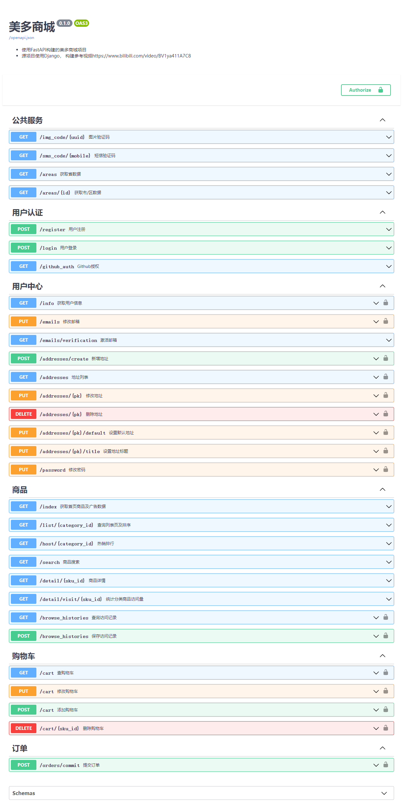

# 介绍
美多商城，本仓库使用FastAPI进行翻抄，大部分API一致，目前抄完部分
# 功能

**其中并没有实现原项目中的Template文件**
# 使用
- [x] redis  -  aioredis
- [x] mysql8  -  tortoise-orm
- [x] elasticsearch -  elasticsearch[async]
- [x] rabbitmq  - celery
- [x] fastdfs  -  py3Fdfs

# 本地运行
1. docker-compose up -d 可以搭建部分环境
2. 或者直接修改.development 中的配置信息
3. pip install -r requirements.txt  (建议提前建立虚拟环境)
4. 新建数据库 mall， 导入score目录下的`mall.sql`文件
5. python main.py
6. 访问IP:8000/docs， 初始登录的账号密码为 string string

## todo
- [ ] 支付对接
- [ ] 代码优化

